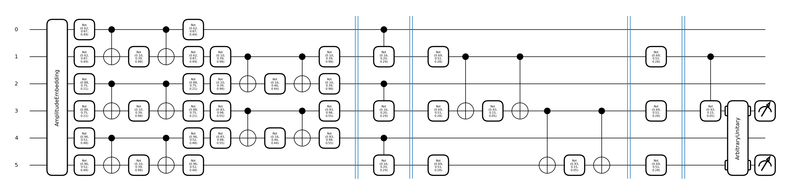
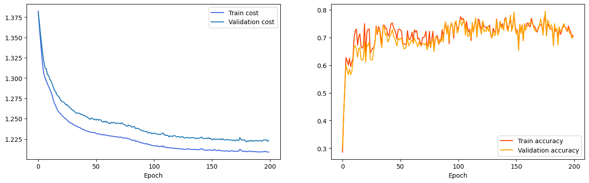

__Quantum multilabel classification with JAX__

__Author:__ Francesco Aldo Venturelli;<br />
__Date created:__ 2024/07/05;<br />
__Description:__ Quantum convolutional neural network (QCNN) for multilabel image classification written by combining Pennylane with JAX.<br />
In this simple tutorial we select four different classes of digits images from the *sklearn.datasets.load_digits* and we construct a quantum convolutional neural network to train and make the classification of multiclass images.<br />
After model training, we select the last updated and optimal parameters (which correspond to the maximum value of the validation accuracy) and use them to test the model on the<br /> unseen test images. To have an idea about all the steps needed to complete the experiment we recommend to have a look at the scripts in the */src* folder.<br />
Hope this could be useful for you, feel free to use these codes and make further improvements. With this code we would like to emphasize the ability of making multilabel classification and stop of being constrained by binary classifications!


__Goal:__ Train a fully quantum convolutional neural network to classify four classes of images using train and validation sets.<br />
The idea behind the project, is also the realize a multilabel classification problem, by measuring two distinct qubits,<br />
and to exploit JAX's speed in vectorizing the training.


__Installing libraries:__<br/>
`!pip install numpy==1.23.5`<br/>
`!pip install scikit-learn==1.3.0`<br/>
`!pip install jax==0.4.8`<br/>
`!pip install optax==0.1.5`<br/>
`!pip install matplotlib==3.7.1`<br/>
`!pip install pennyLane==0.30.0`<br/>


__Project's structure:__ <br/>
──────tutorial__ <br/>
│         ├── run_tutorial.ipynb<br/>
│         ├── config.py<br/>
│         ├── __src__ <br/>
│         │         ├── __init__.py<br/>
│         │         ├── plot_results.py<br/>
│         │         ├── train.py<br/>
│         │         ├── utils.py<br/>
│         │         └── qcnn_architecture.py<br/>
│         └── __dataset__ <br/>
│                   └── digits.py<br/>


__How to run:__
After setting the device with `dev = qml.device("default.qubit, wires=6)` that is found inside __config.py__ file, <b />
create the qnode by passing features and trainable weights inside the corresponding circuits <b />
```python
    @qml.qnode(device=dev, interface="jax")
    def qcnn(data: jnp.array, params: jnp.array) -> qml.probs:
        """
        It computes the QCNN architecture and returns probabilities of detecting a class of images.
        :param data: (jnp.array) The input data to encode;
        :param params: (jnp.array) The weights within the layers;
        :return: probs: (list) The probabilities of detecting a class.
        """
        circuit = QCNNArchitecture(device=dev, wires=wires)
        qml.AmplitudeEmbedding(features=data, wires=range(len(wires)), normalize=True, pad_with=0.)
        circuit.QCNN(params)
        probs = qml.probs(wires=[3, 5])
        return probs
```
and call the function `training` iniside __train.py__ file by providing: <b />
seed; <b />
model (callable); <b />
selected_shape (int); <b />
n_epochs (int); <b />
batch_size (int);<b />
X_train;<b />
y_train;<b />
X_val;<b />
y_val <b />
like this way <b />
```python
    loss_train, acc_train, loss_val, acc_val, last_params, opt_params = (
    training(seed=seed, model=q_model, selected_shape=params_size, n_epochs=n_epochs,
         batch_size=batch_size, X_train=X_train, y_train=y_train,
         X_val=X_val, y_val=y_val)
)
```

__Results:__ <b/>
first 5 epochs <b />
```python
    Epoch: 1, ---Train loss:  1.3487786 ---Train acc:  0.5888889 | ---Val loss:  1.3560866 ---Val acc:  0.5590278
    Epoch: 2, ---Train loss:  1.3203659 ---Train acc:  0.5833333 | ---Val loss:  1.3288699 ---Val acc:  0.5208333
    Epoch: 3, ---Train loss:  1.3049574 ---Train acc:  0.57222223 | ---Val loss:  1.3162484 ---Val acc:  0.4861111
    Epoch: 4, ---Train loss:  1.2908537 ---Train acc:  0.5861111 | ---Val loss:  1.3038398 ---Val acc:  0.5069444
    Epoch: 5, ---Train loss:  1.2784407 ---Train acc:  0.59166664 | ---Val loss:  1.2922341 ---Val acc:  0.5104167
```
<b />
QCNN model:
how the architecture looks like. 
<p align="center">
  
</p>
<b />
Loss and accuracy plots <b />
<p align="center">
  
</p>


